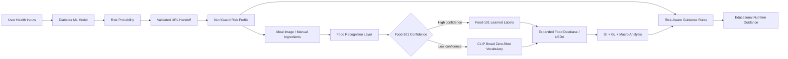

# 🥗 NutriGuard AI

## Risk-Aware Educational Nutrition Assistant

NutriGuard AI is the nutrition companion to the **Explainable AI Diabetes Risk Prediction** project. It combines meal-image recognition, an expanded everyday-food nutrition database, glycemic-impact estimates and a validated diabetes-risk handoff to create a connected educational workflow.

## 🌐 Live Applications

- **Diabetes Risk Predictor:** https://medical-it-diabetes-ai-project-jkv5wwfmjmjugk5frfffut.streamlit.app/
- **NutriGuard AI:** https://nutriguard-ai-rrzi6rnezvcba9dhtgzlrm.streamlit.app/

## 🔗 Connected Risk-to-Nutrition Workflow

The two applications are connected rather than isolated demos.



The diabetes application sends its model output using a `risk` query parameter. NutriGuard treats this value as untrusted external input, validates it as a percentage between 0 and 100, and falls back safely when the value is invalid.

## 🛡️ Input Validation

`src/risk_context.py` provides:

- numeric conversion with error handling;
- strict 0–100% range validation;
- safe fallback for malformed or out-of-range values;
- deterministic Low / Moderate / Elevated risk bands.

This prevents malformed query strings from producing impossible risk states.

## 🧠 Context-Aware Nutrition Logic

| Risk profile | Educational emphasis |
|---|---|
| **Low (<30%)** | Balanced nutrition, vegetables, fiber and adequate protein |
| **Moderate (30–59.9%)** | Fiber, portion balance, whole grains, vegetables and carbohydrate quality |
| **Elevated (≥60%)** | Stronger emphasis on fiber-rich foods, vegetables, balanced portions and limiting sugary drinks/refined carbohydrates |

The interface displays a **System Core / Logic Trace** so reviewers can see how the received risk affects the nutrition guidance.

> **Engineering honesty:** the current repository does not contain an LLM-based medical dietitian. The context layer is deliberately implemented as deterministic rules rather than pretending that an LLM or clinical decision engine exists.

## 📷 Two-Stage Pretrained Food Recognition

NutriGuard now uses a two-stage recognition strategy:

1. **Food-101 classifier:** `nateraw/food` provides a fixed set of 101 learned food categories.
2. **Broad zero-shot fallback:** when Food-101 confidence is below 70%, the application uses `openai/clip-vit-base-patch32` to compare the image against a broader vocabulary of everyday foods.

The second stage does **not** retrain CLIP or claim that every food can be identified perfectly. It is a zero-shot matching layer that gives the application a substantially wider vocabulary than Food-101 while remaining transparent about uncertainty.

The broad vocabulary includes fruits, vegetables, grains, Indian foods, Asian foods, breads, pasta, noodles, meats, seafood, dairy, legumes, snacks, desserts and beverages. The current vocabulary contains well over 200 food labels and can be expanded without retraining a classifier head.

For traceability, the application reports:

- the recognition route used;
- the model name;
- the number of candidate labels searched;
- the detected food;
- recognition confidence; and
- top alternative predictions.

### Why not claim “every food in the world”?

A responsible image-recognition system should not claim universal recognition unless it has been trained and validated for that scope. Food appearance varies with cuisine, preparation, plating, lighting and mixed dishes. NutriGuard therefore uses **broad recognition + confidence reporting + manual ingredient correction + nutrition-data fallback** instead of presenting uncertain predictions as facts.

## 🍎 Expanded Food Database

NutriGuard combines the original `foods.csv` records with `everyday_foods.csv`.

The expanded database covers everyday foods across categories including:

- Fruits and vegetables
- Rice, grains and cereals
- Lentils, beans and legumes
- Eggs, dairy and plant proteins
- Chicken, fish and seafood
- Breads, pasta and noodles
- Salads, soups and common meals
- Indian foods and snacks
- Korean foods and meals
- Nuts, seeds and spreads
- Desserts and beverages

Each record can provide calories, carbohydrates, protein, fat, fiber, estimated GI/GL and an educational healthier-swap suggestion where available.

The application combines both CSV files at startup and removes duplicate food names, so the interface can work with the expanded set without requiring a separate selection screen.

## 📊 Nutrition Analysis

For a verified food match, NutriGuard displays calories, carbohydrates, protein, fat, fiber, estimated GI/GL where available, a risk-aware educational focus and healthier food-swap suggestions.

The **Generate Nutrition Analysis** button is the explicit action that turns the submitted meal context into the visible analysis section.

GI/GL and nutrition values are educational estimates because actual nutritional values vary with portion size, ingredients and preparation.

## 🧪 Automated Tests

`tests/test_risk_context.py` verifies valid risk values, malformed/out-of-range fallbacks, risk-band boundaries and risk-dependent nutrition context.

```bash
python -m pytest -q
```

## 🏗️ Architecture

```text
NutriGuard-AI/
├── src/
│   ├── risk_context.py
│   └── usda_nutrition.py
├── tests/
│   └── test_risk_context.py
├── app.py
├── food_recognition.py        # Food-101 + broad CLIP recognition
├── foods.csv
├── everyday_foods.csv
├── translations.py
├── requirements.txt
├── .streamlit/
│   └── config.toml
├── assets/
├── docs/
├── screenshots/
└── README.md
```

## 🎨 Clinical Design System

- Slate blue: `#1E3A8A`
- Teal: `#0D9488`
- Off-white canvas: `#F8FAFC`
- White content surfaces
- Functional green / amber / crimson status colors
- Sans-serif typography

## 🔬 What Makes the Project Different

**Risk estimation → secure data handoff → risk-aware nutrition context → two-stage food-image recognition → expanded nutrition database → transparent nutrition analysis → educational guidance**

The project demonstrates a useful engineering pattern: a specialized supervised classifier handles known classes first, while a zero-shot vision-language model provides broader vocabulary coverage when the specialist model is uncertain. The nutrition layer remains separate from image recognition, making the system easier to extend and audit.

## 🔐 Privacy and Medical Scope

NutriGuard AI is an educational application. It does not diagnose diabetes, prescribe treatment or replace a doctor or registered dietitian.

The risk handoff uses a URL query parameter for application-integration demonstration. The project does not claim to maintain a persistent electronic health record or clinical patient database.

Food recognition, GI/GL values and nutrition estimates can vary with ingredients, preparation methods, portion size and image quality. Users should verify uncertain image predictions and manually correct the meal description when needed.

## 🚀 Run Locally

```bash
git clone https://github.com/kashish-alt0786/NutriGuard-AI.git
cd NutriGuard-AI
python -m pip install -r requirements.txt
python -m pytest -q
streamlit run app.py
```

The first image-recognition request may download pretrained Hugging Face model weights. The broad CLIP fallback requires additional memory and may take longer to initialize than the Food-101 classifier.

## ⚠️ Medical Disclaimer

NutriGuard AI provides educational nutritional information only. It is not a replacement for professional medical diagnosis, treatment or advice. Users should consult qualified healthcare professionals for medical decisions.

## 👩‍💻 Developer

**Kashish** — AI & Healthcare Technology Enthusiast

GitHub: https://github.com/kashish-alt0786/NutriGuard-AI

## 📌 Version

`v1.4.0`

© 2026 NutriGuard AI
