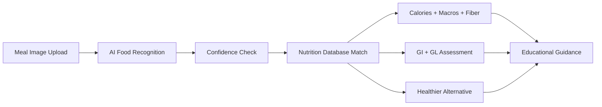

# 🥗 NutriGuard AI

## AI-Based Diabetes-Aware Nutrition Assistant

NutriGuard AI is an educational Streamlit application that connects food recognition with nutrition analysis and diabetes-aware meal guidance.

## 🌐 Live Demo

https://nutriguard-ai-rrzi6rnezvcba9dhtgzlrm.streamlit.app/

## 🎯 What the current application does

The current interface is intentionally centered on **meal-image upload**. It does not duplicate the previous manual food-selection workflow.

The user flow is:

**Upload meal image → AI food recognition → Nutrition analysis → Glycemic assessment → Healthier alternative → Educational resources**

## ✨ Current Features

### 📷 AI Food Recognition

- Upload a JPG, JPEG or PNG meal image.
- The recognition module returns a detected food label and confidence score.
- The interface can show the top recognition candidates.
- A confidence threshold is used before matching the detected food to the nutrition database.

### 📊 Nutrition Analysis

For a recognized database match, the app displays:

- Calories
- Carbohydrates
- Protein
- Fat
- Fiber
- Estimated Glycemic Index (GI)
- Estimated Glycemic Load (GL)

### 🩺 Glycemic Assessment

The app classifies the estimated glycemic impact as **Low, Moderate or High** using the stored GL value and provides an educational explanation.

### 🥗 Healthier Alternative

The database can provide a recommended food swap, explain why it is suggested and summarize expected educational benefits such as higher fiber or lower estimated glycemic load.

### 📈 Meal History Demonstration

The application includes a weekly glycemic-impact visualization. The current history is explicitly a **demonstration feature**; it does not claim to persist a real patient's longitudinal record.

### 🌐 Multilingual Interface

The current application provides English and Korean language selection.

### 📚 Educational Resources

The app links users to trusted nutrition and health organizations, including USDA FoodData Central, WHO, ICMR–National Institute of Nutrition, the American Diabetes Association and Korean Nutrition Society.

## 🏥 Clinical Design System

The Streamlit theme uses a clean medical/clinical palette:

- Primary slate blue: `#1E3A8A`
- Secondary teal: `#0D9488`
- Canvas: `#F8FAFC`
- Surface: `#FFFFFF`
- Functional status colors: green, amber and crimson
- Sans-serif typography

Theme configuration is stored in `.streamlit/config.toml`.

## 🔄 Connection with the Diabetes AI Project

NutriGuard AI is the nutrition companion to the diabetes-risk screening application:

**Diabetes Risk Screening → Preferred Diet → Lifestyle → Manage Your Nutrition → NutriGuard AI**

Diabetes AI application:
https://medical-it-diabetes-ai-project-jkv5wwfmjmjugk5frfffut.streamlit.app/

The two repositories are separate applications with a connected educational workflow.

## 🏗️ Architecture



## 🧰 Technology Stack

- Python
- Streamlit
- Pandas
- Plotly
- Pillow
- Food-recognition module
- CSV-based nutrition database

## 📂 Project Structure

```text
NutriGuard-AI/
├── app.py
├── food_recognition.py
├── foods.csv
├── translations.py
├── requirements.txt
├── .streamlit/
│   └── config.toml
├── assets/
├── docs/
├── screenshots/
└── README.md
```

## 🚀 Run Locally

```bash
git clone https://github.com/kashish-alt0786/NutriGuard-AI.git
cd NutriGuard-AI
python -m pip install -r requirements.txt
streamlit run app.py
```

## 🔐 Privacy and Medical Scope

NutriGuard AI is an educational application. It does not diagnose diabetes, prescribe treatment or replace a doctor or registered dietitian.

Food recognition, serving information, GI/GL values and nutrition estimates can vary with ingredients, preparation methods, portion size and image quality.

The current application does not present itself as a persistent electronic health-record system.

## ⚠️ Medical Disclaimer

NutriGuard AI provides educational nutritional insights only. It is not a replacement for professional medical diagnosis, treatment or advice. Users should consult qualified healthcare professionals for medical decisions.

## 👩‍💻 Developer

**Kashish** — AI & Healthcare Technology Enthusiast

GitHub: https://github.com/kashish-alt0786/NutriGuard-AI

## 📌 Version

`v1.0.0`

© 2026 NutriGuard AI
