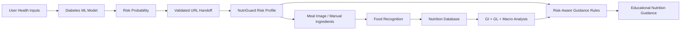

# 🥗 NutriGuard AI

## Risk-Aware Educational Nutrition Assistant

NutriGuard AI is the nutrition companion to the **Explainable AI Diabetes Risk Prediction** project. It combines meal-image recognition, a nutrition database, glycemic-impact estimates and a validated diabetes-risk handoff to create a connected educational workflow.

## 🌐 Live Applications

- **Diabetes Risk Predictor:** https://medical-it-diabetes-ai-project-jkv5wwfmjmjugk5frfffut.streamlit.app/
- **NutriGuard AI:** https://nutriguard-ai-rrzi6rnezvcba9dhtgzlrm.streamlit.app/

## 🔗 Connected Risk-to-Nutrition Workflow

The two applications are connected rather than isolated demos.



The diabetes application sends its model output using a `risk` query parameter. NutriGuard treats this value as untrusted external input, validates it as a percentage between 0 and 100, and falls back safely when the value is invalid.

## 🛡️ Input Validation

`src/risk_context.py` provides:

- numeric conversion with error handling;
- strict 0–100% range validation;
- safe fallback for malformed or out-of-range values;
- deterministic Low / Moderate / Elevated risk bands.

This prevents malformed query strings from producing impossible risk states.

## 🧠 Context-Aware Nutrition Logic

| Risk profile | Educational emphasis |
|---|---|
| **Low (<30%)** | Balanced nutrition, vegetables, fiber and adequate protein |
| **Moderate (30–59.9%)** | Fiber, portion balance, whole grains, vegetables and carbohydrate quality |
| **Elevated (≥60%)** | Stronger emphasis on fiber-rich foods, vegetables, balanced portions and limiting sugary drinks/refined carbohydrates |

The interface displays a **System Core / Logic Trace** so reviewers can see how the received risk affects the nutrition guidance.

> **Engineering honesty:** the current repository does not contain an LLM-based medical dietitian. The context layer is deliberately implemented as deterministic rules rather than pretending that an LLM or clinical decision engine exists.

## 📷 Meal Intelligence

- Upload JPG, JPEG or PNG meal images.
- Display detected food and recognition confidence.
- Show top recognition candidates.
- Apply a confidence threshold before matching the food to the nutrition database.
- Allow manual ingredient context to supplement recognition.

## 📊 Nutrition Analysis

For a verified food match, NutriGuard displays calories, carbohydrates, protein, fat, fiber, estimated GI, estimated GL, an educational nutrition score, a healthier food swap and a balanced-plate visualization.

GI/GL and nutrition scores are explicitly educational estimates because actual nutritional values vary with portion size, ingredients and preparation.

## 🧪 Automated Tests

`tests/test_risk_context.py` verifies valid risk values, malformed/out-of-range fallbacks, risk-band boundaries and risk-dependent nutrition context.

```bash
python -m pytest -q
```

## 🏗️ Architecture

```text
NutriGuard-AI/
├── src/
│   └── risk_context.py
├── tests/
│   └── test_risk_context.py
├── app.py
├── food_recognition.py
├── foods.csv
├── translations.py
├── requirements.txt
├── .streamlit/
│   └── config.toml
├── assets/
├── docs/
├── screenshots/
└── README.md
```

## 🎨 Clinical Design System

- Slate blue: `#1E3A8A`
- Teal: `#0D9488`
- Off-white canvas: `#F8FAFC`
- White content surfaces
- Functional green / amber / crimson status colors
- Sans-serif typography

## 🔬 What Makes the Project Different

**Risk estimation → secure data handoff → risk-aware nutrition context → meal recognition → nutrition analysis → educational guidance**

This demonstrates how separate AI/data components can communicate while keeping their limitations explicit.

## 🔐 Privacy and Medical Scope

NutriGuard AI is an educational application. It does not diagnose diabetes, prescribe treatment or replace a doctor or registered dietitian.

The risk handoff uses a URL query parameter for application-integration demonstration. The project does not claim to maintain a persistent electronic health record or clinical patient database.

Food recognition, GI/GL values and nutrition estimates can vary with ingredients, preparation methods, portion size and image quality.

## 🚀 Run Locally

```bash
git clone https://github.com/kashish-alt0786/NutriGuard-AI.git
cd NutriGuard-AI
python -m pip install -r requirements.txt
python -m pytest -q
streamlit run app.py
```

## ⚠️ Medical Disclaimer

NutriGuard AI provides educational nutritional information only. It is not a replacement for professional medical diagnosis, treatment or advice. Users should consult qualified healthcare professionals for medical decisions.

## 👩‍💻 Developer

**Kashish** — AI & Healthcare Technology Enthusiast

GitHub: https://github.com/kashish-alt0786/NutriGuard-AI

## 📌 Version

`v1.1.0`

© 2026 NutriGuard AI
